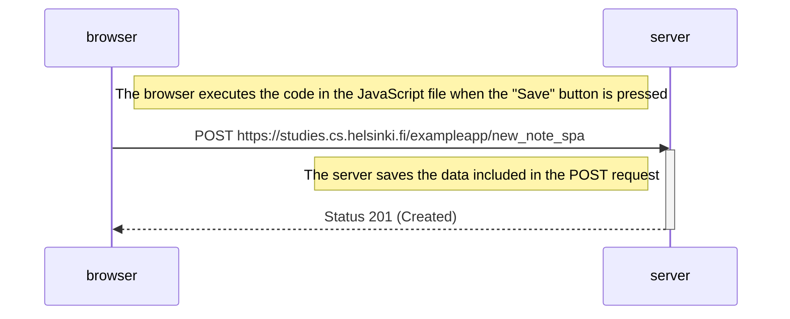

```mermaid
sequenceDiagram
    participant browser
    participant server

    Note right of browser: The browser executes the code in the JavaScript file when the "Save" button is pressed 

    browser->>server: POST https://studies.cs.helsinki.fi/exampleapp/new_note_spa
    activate server
    Note left of server: The server saves the data included in the POST request 
    server-->>browser: Status 201 (Created)
    deactivate server
```